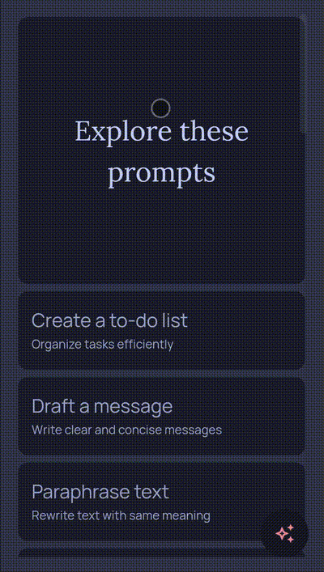
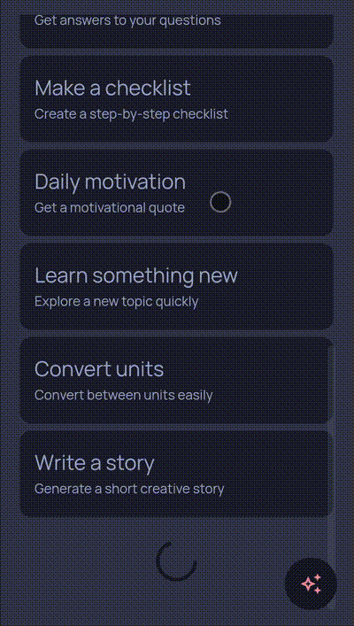
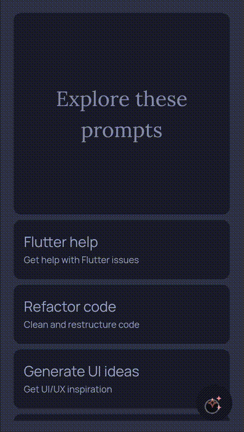
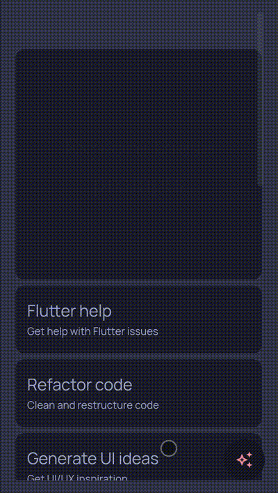

Smart Assistant App – Assta 

🚀 Key Features

    Paginated Suggestions: Implements infinite scrolling using the GET /suggestions endpoint. It handles page-based data fetching with integrated loading and error states.

    Interactive Chat UI: A clean, responsive chat interface that simulates real-time interaction with a dummy assistant.

    Persistent Session Management: Features a specialized navigation drawer for managing and switching between chat sessions.

    Reactive State Architecture: Built entirely with Riverpod for predictable, unidirectional data flow and easy testing.

    Declarative Routing: Uses GoRouter for robust navigation management and deep-linking capabilities.

📱 Visual Gallery

<b>Pull to Refresh</b>

<b>Infinite Scroll Pagination</b>

<b>Interactive Chat UI</b>

<b>Polished UI Transitions</b>

🛠 Tech Stack & Architecture

    Framework: Flutter (Latest Stable) 

    State Management: Riverpod 

    Navigation: GoRouter 

    Networking: http (Standard library for API consumption) 

    Persistence: Handled via custom session logic 

Project Organization

    The project follows a modular structure to ensure separation of concerns and maintainability:
    Plaintext

    lib/
    ├── api/          # http client and network API abstraction
    ├── model/        # Immutable Data Models (Suggestion, Prompt, Session)
    ├── provider/     # Riverpod providers for business logic and state
    ├── ui/           # Responsive screens and reusable UI components
    └── extension/    # Helper extensions for cleaner Dart code

⚙️ Installation & Setup

    Clone the project:
    git clone [your-repo-url]

    Fetch dependencies:
    flutter pub get

    Run the application:
    flutter run
