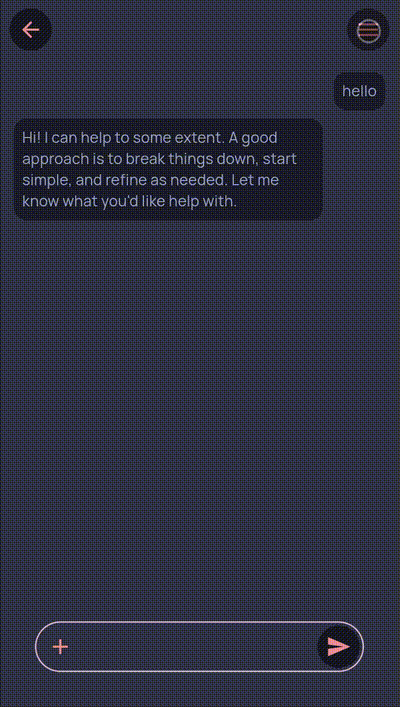
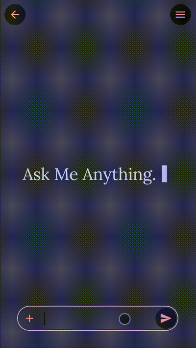
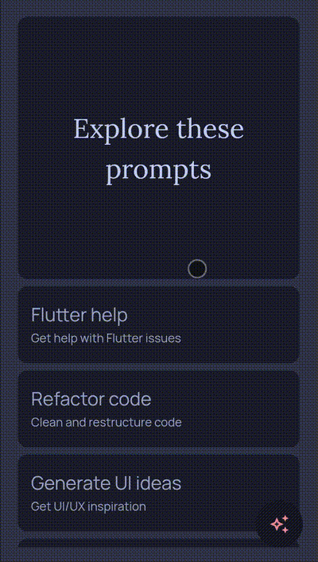

# Demo Assets

This repository contains demo animations and GIFs used in the project.  
All assets are stored in the `demo_assets/` folder and are embedded below for quick reference.

## Assets Gallery

<!-- Row 1 -->

   
  Refresh

   
  Load More

<!-- Row 2 -->

   
  New Chat

   
  Open Old Session

<!-- Row 3 -->

   
  New Prompt

   
  Suggestion Open

<!-- Row 4 -->

   
  Suggestion Animation

## Usage

These GIFs can be used to demonstrate UI behavior in presentations, tutorials, or documentation.  
You can include them in your Flutter project or web app as demo assets.

## License

All assets are proprietary to the project and intended for demonstration purposes only.
