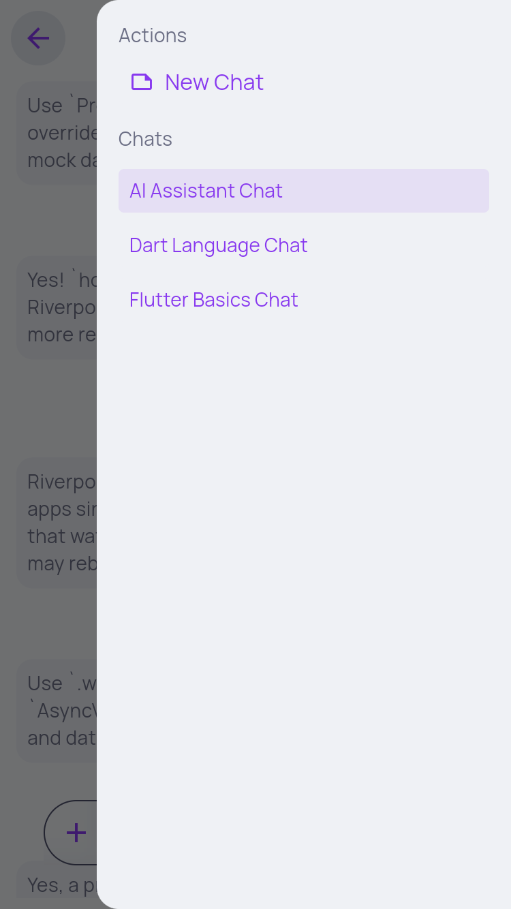
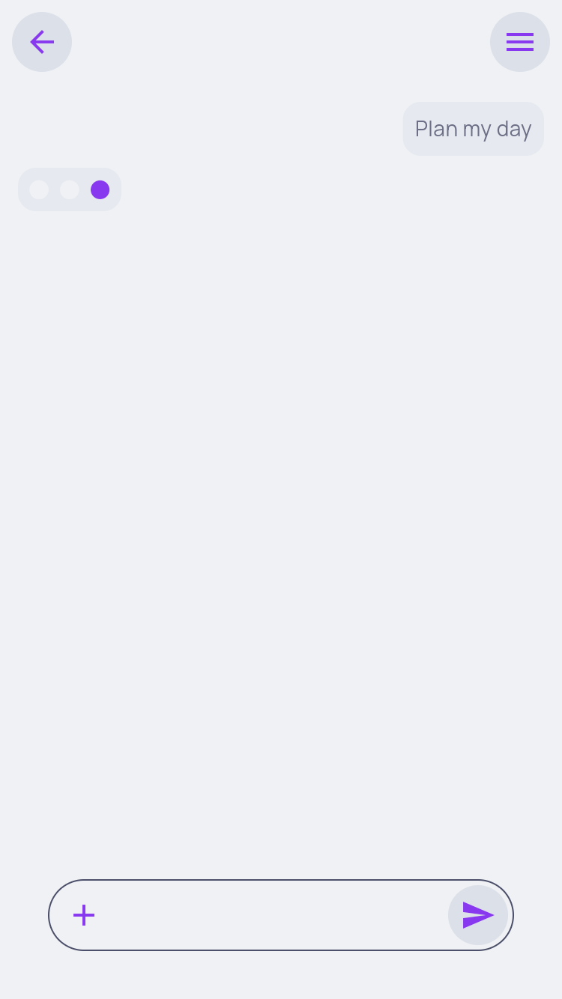
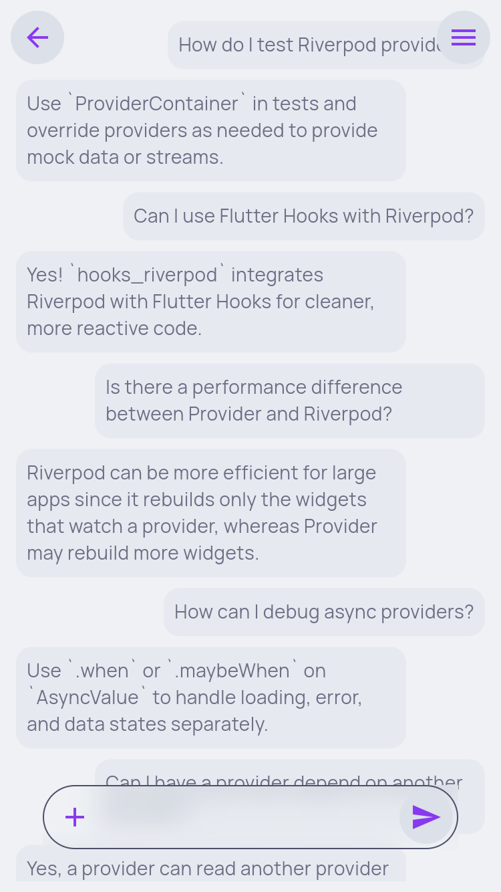
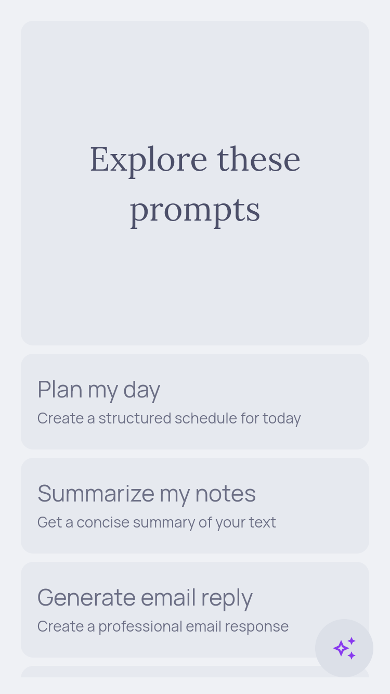
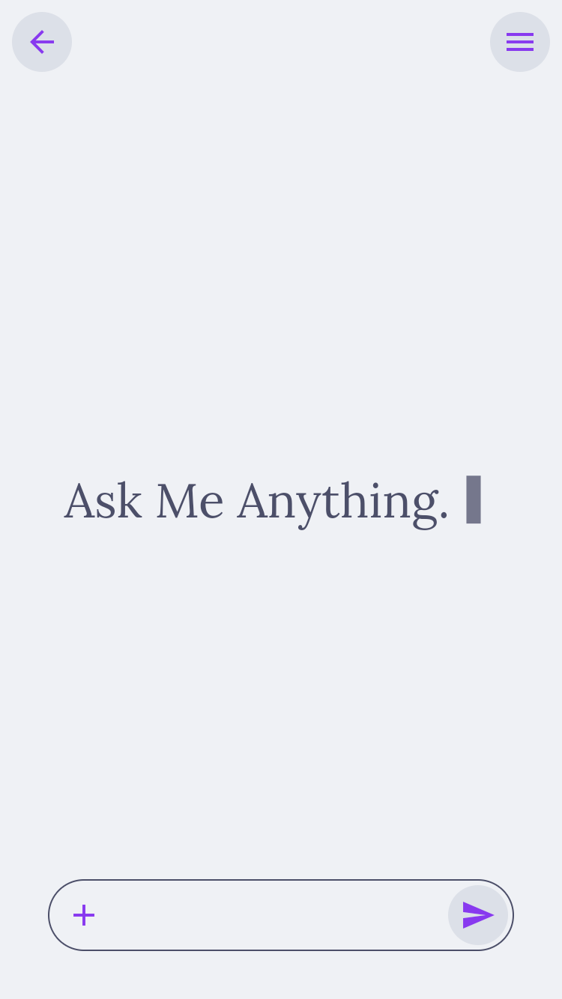
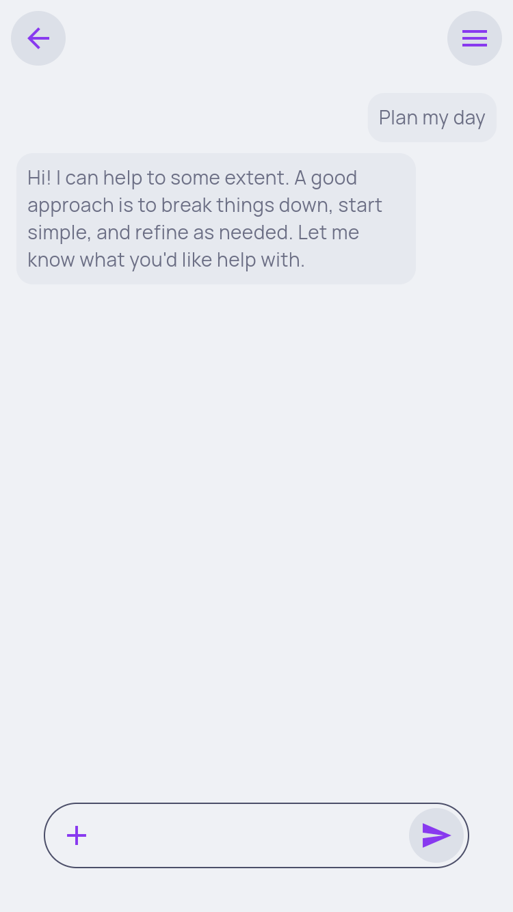

Smart Assistant App – Assta 

🚀 Key Features

    Paginated Suggestions: Implements infinite scrolling using the GET /suggestions endpoint. It handles page-based data fetching with integrated loading and error states.

    Interactive Chat UI: A clean, responsive chat interface that simulates real-time interaction with a dummy assistant.

    Reactive State Architecture: Built entirely with Riverpod for predictable, unidirectional data flow and easy testing.

    Declarative Routing: Uses GoRouter for robust navigation management and deep-linking capabilities.

📱 Visual Gallery

<b>Pull to Refresh</b>

<b>Infinite Scroll Pagination</b>

<b>Interactive Chat UI</b>

<b>Polished UI Transitions</b>

## 📸 Additional Screenshots

Here’s a visual overview of the Smart Assistant App – Assta.  
These screenshots showcase additional features, screens, and interactions in the app.

  

    
    <b>History</b>
  

  

    
    <b>Prompt Loading</b>
  

  

    
    <b>Chat</b>
  

  

    
    <b>Homepage</b>
  

  

    
    <b>New Chat</b>
  

  

    
    <b>Prompt Reply</b>
  

🛠 Tech Stack & Architecture

    Framework: Flutter (Latest Stable) 

    State Management: Riverpod 

    Navigation: GoRouter 

    Networking: http (Standard library for API consumption) 

Project Organization

    The project follows a modular structure to ensure separation of concerns and maintainability:
    Plaintext

    lib/
    ├── api/          # http client and network API abstraction
    ├── model/        # Immutable Data Models (Suggestion, Prompt, Session)
    ├── provider/     # Riverpod providers for business logic and state
    ├── ui/           # Responsive screens and reusable UI components
    └── extension/    # Helper extensions for cleaner Dart code

⚙️ Installation & Setup

    Clone the project:
    git clone git clone https://github.com/oneto6/assta.git

    Fetch dependencies:
    flutter pub get

    Run the application:
    flutter run

🌐 Live Preview

    You can check out the live GitHub Pages version of the app here:
    https://oneto6.github.io/assta/

## 📥 Download & Releases

    You can download the latest **Android APK** or other build artifacts from the GitHub Releases page:

    [**Download Latest Release**](https://github.com/oneto6/assta/releases)

    > Note: The releases section contains pre-built binaries for easy installation.  
    > For source code and building from scratch, see the instructions above.
